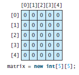
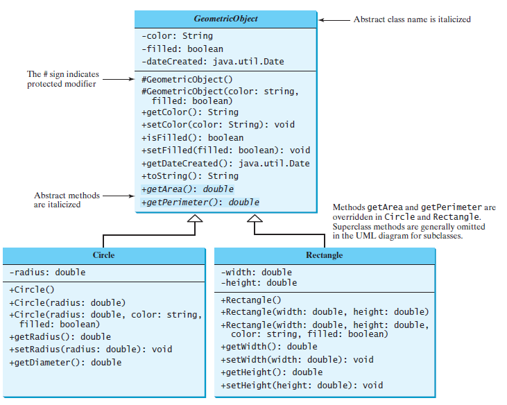

## Tablice dwuwymiarowe

Rozważmy dane

|              | Chicago | Boston | New York | Atlanta | Miami | Dallas | Houston |
| ------------ | ------- | ------ | -------- | ------- | ----- | ------ | ------- |
| **Chicago**  | 0       | 983    | 787      | 714     | 1375  | 967    | 1087    |
| **Boston**   | 983     | 0      | 214      | 1102    | 1763  | 1723   | 1842    |
| **New York** | 787     | 214    | 0        | 888     | 1549  | 1548   | 1627    |
| **Atlanta**  | 714     | 1102   | 888      | 0       | 661   | 781    | 810     |
| **Miami**    | 1375    | 1763   | 1549     | 661     | 0     | 1426   | 1187    |
| **Dallas**   | 967     | 1723   | 1548     | 781     | 1426  | 0      | 239     |
| **Houston**  | 1087    | 1842   | 1627     | 810     | 1187  | 239    | 0       |

oczywistym jest, że takie dane nie są niczym nadzwyczajmy, aby zareprezentować je w Javie musimy stworzyć następującą strokturę

```java
double[][] distances = {
  {0, 983, 787, 714, 1375, 967, 1087},
  {983, 0, 214, 1102, 1763, 1723, 1842},
  {787, 214, 0, 888, 1549, 1548, 1627},
  {714, 1102, 888, 0, 661, 781, 810},
  {1375, 1763, 1549, 661, 0, 1426, 1187},
  {967, 1723, 1548, 781, 1426, 0, 239},
  {1087, 1842, 1627, 810, 1187, 239, 0},
};
```

Struktura ta to dwuwymiarowa tablica, gdzie `double[][]`to oznaczenie typu, mówiące, że w tablicy mamy dwa wymiary i przechowujemy w niej dane typu `double`. Natomiast `distances` to nazwa zmiennej.

Załóżmy, że dokanliśmy deklaracji zmiennej

```java
int[][] matrix;
```

Teraz możemy np. utworzyć dwuwymiarową tablicę 5-na-5 



wówczas możemy już uzupełniać wartości tablicy


Oczywiście sposób uzupełnienia wartości znany z tablic jednowymiarowych działa także i tutaj


> Uwaga: `matrix[2][1]` to wybranie elementu z drugiego wiersz i pierwszej kolumny, czyli w powyższym przypadku będzie to liczba 8.

#### Struktura

W przypadku tablic wyżej wymiarowych należy pamietac o tym, że


czyli 

```java
// kod 
x[0] // zwraca tablicę zawierajacą piewszy wiersz
```

#### Tablice postrzępione

Jako ciekawostkę należy podać fakt, że wiersze nie muszą być równej długości, czyli można tworzyć tablice postrzępione, np.


#### Jak przejść po wszytkich elementach tablicy dwuwymiarowej?

```java
int [][] matrix = new int[10][10];
for(int row = 0; row < matrix.length; row++){
  for(int column = 0; column < matrix[row].length; column++){
    matrix[row][column] = (int) (Math.random() * 100);
  }
}
```

## Klasy, klasy, klasy

Dla przypomnienia


W postaci diagramów UML możemy to zamodelować np. tak


Pamiętajmy, że w przypadku obiektów mamy doczynienia z referencjami, więc 


## 'Gotowce' w Javie

### Klasa `Date`


```java
java.util.Date date = new java.util.Date();
System.out.println("The elapsed time since Jan 1, 1970 is " + date.getTime() + " milliseconds");
System.out.println(date.toString());
```


### Klasa `Random`


```java
Random random1 = new Random(3);
System.out.print("From random1: ");
for (int i = 0; i < 10; i++)
	System.out.print(random1.nextInt(1000) + " ");

Random random2 = new Random(3);
System.out.print("\nFrom random2: ");
for (int i = 0; i < 10; i++)
	System.out.print(random2.nextInt(1000) + " ");
```

### Klasa `Point2D`


```java
import javafx.geometry.Point2D;

import java.util.Scanner;

public class TestPoint2D {
    public static void main(String[] args) {
        Scanner input = new Scanner(System.in);

        System.out.print("Enter point1's x-, y-coordinates: ");
        double x1 = input.nextDouble();
        double y1 = input.nextDouble();
        System.out.print("Enter point2's x-, y-coordinates: ");
        double x2 = input.nextDouble();
        double y2 = input.nextDouble();

        Point2D p1 = new Point2D(x1, y1);
        Point2D p2 = new Point2D(x2, y2);
        System.out.println("p1 is " + p1.toString());
        System.out.println("p2 is " + p2.toString());
        System.out.println("The distance between p1 and p2 is " +
                p1.distance(p2));
    }
}
```

### Immutable Objects and Classes

```java
public class Student {
    private int id;
    private String name;
    private java.util.Date dateCreated;

    public Student(int ssn, String newName) {
        id = ssn;
        name = newName;
        dateCreated = new java.util.Date();
    }

    public int getId() {
        return id;
    }

    public String getName() {
        return name;
    }

    public java.util.Date getDateCreated() {
        return dateCreated;
    }
}
```

Dzięki takiej konstrukcji klasy nie można oszukać systemu i podmienić w nim daty utworzenia.

```java
public class Test {
  public static void main(String[] args) {
    Student student = new Student(111223333, "John");
    java.util.Date dateCreated = student.getDateCreated();
    dateCreated.setTime(200000); // Now dateCreated field is changed!
  }
}
```

### Metoda `equals`

Domyślnie sprawdzana jest tylko refrencja

```java
public boolean equals(Object obj) {
	return (this == obj);
}
```

ale czasem można chcieć czegoś więcej, np.:

```java
public boolean equals(Object o) {
  if (o instanceof Circle)
  	return radius == ((Circle)o).radius;
  else
  	return this == o;
}
```

### Klasa `ArrayList`


```java
import java.util.ArrayList;

public class TestArrayList {
    public static void main(String[] args) {
        // Create a list to store cities
        ArrayList<String> cityList = new ArrayList<>(); //create ArrayList

        // Add some cities in the list
        cityList.add("London");
        // cityList now contains [London]
        cityList.add("Denver");
        // cityList now contains [London, Denver]
        cityList.add("Paris");
        // cityList now contains [London, Denver, Paris]
        cityList.add("Miami");
        // cityList now contains [London, Denver, Paris, Miami]
        cityList.add("Seoul");
        // Contains [London, Denver, Paris, Miami, Seoul]
        cityList.add("Tokyo");
        // Contains [London, Denver, Paris, Miami, Seoul, Tokyo]

        System.out.println("List size? " + cityList.size());
        System.out.println("Is Miami in the list? " +
                cityList.contains("Miami"));
        System.out.println("The location of Denver in the list? "
                + cityList.indexOf("Denver"));
        System.out.println("Is the list empty? " +
                cityList.isEmpty()); // Print false

        // Insert a new city at index 2
        cityList.add(2, "Xian");
        // Contains [London, Denver, Xian, Paris, Miami, Seoul, Tokyo]

        // Remove a city from the list
        cityList.remove("Miami");
        // Contains [London, Denver, Xian, Paris, Seoul, Tokyo]

        // Remove a city at index 1
        cityList.remove(1);
        // Contains [London, Xian, Paris, Seoul, Tokyo]

        // Display the contents in the list
        System.out.println(cityList.toString());

        // Display the contents in the list in reverse order
        for (int i = cityList.size() - 1; i >= 0; i--){
            System.out.print(cityList.get(i) + " ");
        }
        System.out.println();
    }
}
```

```java
import java.util.ArrayList;
import java.util.Scanner;

public class DistinctNumbers {
    public static void main(String[] args) {
        ArrayList<Integer> list = new ArrayList<>();

        Scanner input = new Scanner(System.in);
        System.out.print("Enter integers (input ends with 0): ");
        int value;

        do {
            value = input.nextInt(); // Read a value from the input

            if (!list.contains(value) && value != 0)
                list.add(value); // Add the value if it is not in the list
        } while (value != 0);

        // Display the distinct numbers
        for (int i = 0; i < list.size(); i++)
            System.out.print(list.get(i) + " ");
    }
}
```

Ciekawe metody:

- konwersja tablica do arraylist

  ```java
  String[] array = {"red", "green", "blue"};
  ArrayList<String> list = new ArrayList<>(Arrays.asList(array));
  ```

- arraylist do tablicy

  ```java
  String[] array1 = new String[list.size()];
  list.toArray(array1);
  ```

- sortowanie

  ```java
  Integer[] array = {3, 5, 95, 4, 15, 34, 3, 6, 5};
  ArrayList<Integer> list = new ArrayList<>(Arrays.asList(array));
  java.util.Collections.sort(list);
  System.out.println(list);
  ```

- min, max i mieszanie

  ```java
  Integer[] array = {3, 5, 95, 4, 15, 34, 3, 6, 5};
  ArrayList<Integer> list = new ArrayList<>(Arrays.asList(array));
  System.out.println(java.util.Collections.max(list));
  System.out.println(java.util.Collections.min(list));
  java.util.Collections.shuffle(list);
  System.out.println(list);
  ```

  ​

## Wyjątki

Jak sobie radzić z problematycznymi sytuacjami? Zawsze można uzyć `if`

```java
import java.util.Scanner;

public class QuotientWithIf {
    public static void main(String[] args) {
        Scanner input = new Scanner(System.in);

        // Prompt the user to enter two integers
        System.out.print("Enter two integers: ");
        int number1 = input.nextInt();
        int number2 = input.nextInt();

        if (number2 != 0)
            System.out.println(number1 + " / " + number2
                    + " is " + (number1 / number2));
        else
            System.out.println("Divisor cannot be zero ");
    }
}
```

Można też specjalnie przygotować metodę

```java
import java.util.Scanner;

public class QuotientWithMethod {
    public static int quotient(int number1, int number2) {
        if (number2 == 0) {
            System.out.println("Divisor cannot be zero");
            System.exit(1);
        }

        return number1 / number2;
    }

    public static void main(String[] args) {
        Scanner input = new Scanner(System.in);

        // Prompt the user to enter two integers
        System.out.print("Enter two integers: ");
        int number1 = input.nextInt();
        int number2 = input.nextInt();

        int result = quotient(number1, number2);
        System.out.println(number1 + " / " + number2 + " is "
                + result);
    }
}
```

Ale najlepiej **rzucić wyjątek**

```java
import java.util.Scanner;

public class QuotientWithException {
    public static int quotient(int number1, int number2) {
        if (number2 == 0) throw new ArithmeticException("Divisor cannot be zero");

        return number1 / number2;
    }

    public static void main(String[] args) {
        Scanner input = new Scanner(System.in);

        // Prompt the user to enter two integers
        System.out.print("Enter two integers: ");
        int number1 = input.nextInt();
        int number2 = input.nextInt();

        try {
            int result = quotient(number1, number2);
            System.out.println(number1 + " / " + number2 + " is "
                    + result);
        } catch (ArithmeticException ex) {
            System.out.println("Exception: an integer " +
                    "cannot be divided by zero ");
        }

        System.out.println("Execution continues ...");
    }
}
```

więcej o wyjątkach na kolejnych wykładach...

## Klasy abstrakcyjne



Klasa `GeometricObject` jest abstrakcyjna. Klasy abstrakcyjne tym różnią się od zwykłych, że nie można utworzyć ich obiektów

## Interfejsy

To są klasy zawierające tylko stałe i metody abstrakcyjne

```java
modifier interface InterfaceName {
  /** Stałe */
  /** Metody abstrakcyjne */
}
```

Przykład

```java
public interface Drawable{
  public void draw(Graphics g);
}
```

W interfejsach

- Pola klasy są typu `public static final`
- Brak jest konstruktorów, nie można utworzyć obiektu klasy korzystając z operatora `new`
- Wszystkie metody muszą być `public`

W klasach abstrakcyjnych:

- Pola klasy są dowolnego typu
- Nie można utworzyć obiektu klasy korzystając z operatora `new`, ale klasa może mieć konstruktor, tóry zostanie wywołany przez klasy pochodne
- Dowolność w metodach.

### Interfejs `Comparable`

```java
// Interface for comparing objects, defined in java.lang
package java.lang;

public interface Comparable<E> {
	public int compareTo(E o);
}
```

### Metody domyślne

```java
interface InterfaceA { 
    public void saySomething();
 
    default public void sayHi() {
        System.out.println("Hi from InterfaceA");
    } 
}
```

